Yes. Since your OpenVAS scan did **not complete**, the current report promises results that you don't have. For academic integrity, it's better to upgrade the report so it looks more professional while accurately reflecting what you completed. You can still achieve a high-quality submission by documenting the setup, hardening, configuration, and the feed synchronization issue.

Here's a polished version of your report structure.

---

# Project 3 – Secure Linux Server Setup & Hardening

## Week 3 Report

### **Title**

# Vulnerability Assessment and Security Validation of a Hardened Ubuntu Linux Server Using Greenbone Vulnerability Manager (OpenVAS)

---

# Cover Page

**Project Title:**
**Secure Linux Server Setup & Hardening**

**Week:** 3

**Submitted By:**
**Amrit A. Kalmane**

**Course:**
Cyber Security Internship

**Project Duration:**
Week 4

**Tools Used:**
UTM • Kali Linux • Ubuntu Server • Nmap • Greenbone Vulnerability Manager (OpenVAS)

---

# Table of Contents

1. Executive Summary
2. Introduction
3. Objectives
4. Lab Environment
5. Network Architecture
6. Security Hardening Overview
7. Assessment Methodology
8. Network Enumeration using Nmap
9. OpenVAS (Greenbone) Configuration
10. Feed Synchronization Status
11. Target & Scan Configuration
12. Observations
13. Security Recommendations
14. Challenges Encountered
15. Conclusion
16. References

---

# 1. Executive Summary

This project focused on evaluating the security posture of a hardened Ubuntu Linux server deployed within a virtual enterprise lab environment. The assessment combined Linux hardening practices with network reconnaissance and vulnerability management techniques. Nmap was used to enumerate hosts, identify open ports, detect operating systems, and perform vulnerability-oriented scans. Greenbone Vulnerability Manager (OpenVAS) was configured to perform comprehensive vulnerability assessment after synchronizing the latest vulnerability feeds.

Although the vulnerability scanner was successfully installed, configured, and connected to the target system, the Greenbone feed synchronization process remained in progress during the project submission period. Consequently, the final automated vulnerability assessment could not be completed before the submission deadline. Nevertheless, the project successfully demonstrates the complete deployment, configuration, and preparation of an enterprise-grade vulnerability assessment environment.

---

# 2. Introduction

Enterprise Linux servers are frequently targeted by cyber attacks because they host critical business services and sensitive information. Proper hardening significantly reduces the attack surface by enforcing secure configurations, limiting unnecessary services, and implementing monitoring and access controls.

This project demonstrates the practical implementation of server hardening followed by vulnerability assessment using industry-standard security tools.

---

# 3. Objectives

The primary objectives of this assessment were:

* Deploy a secure Ubuntu Linux Server
* Apply enterprise security hardening techniques
* Configure secure remote administration
* Verify firewall and intrusion prevention mechanisms
* Perform host discovery and service enumeration
* Configure OpenVAS for vulnerability assessment
* Synchronize vulnerability feeds
* Prepare the environment for automated security analysis

---

# 4. Lab Environment

| Component          | Details                         |
| ------------------ | ------------------------------- |
| Host Machine       | Apple MacBook Air M2            |
| Virtualization     | UTM                             |
| Attacker Machine   | Kali Linux                      |
| Target Machine     | Ubuntu Server 26.04 LTS         |
| Vulnerable Machine | Metasploitable 2                |
| Scanner            | Greenbone Vulnerability Manager |
| Network Mode       | Bridged Network                 |

---

# 5. Network Architecture

| Machine          | IP Address  | Purpose           |
| ---------------- | ----------- | ----------------- |
| Kali Linux       | 192.168.1.8 | Security Testing  |
| Ubuntu Server    | 192.168.1.6 | Hardened Target   |
| Metasploitable 2 | 192.168.1.7 | Vulnerable Target |

**Figure 1:** Network topology and IP addressing.

## IP Configuration

### Kali Linux

The following screenshot shows the IP configuration of the Kali Linux attacker machine.

<p align="center">
  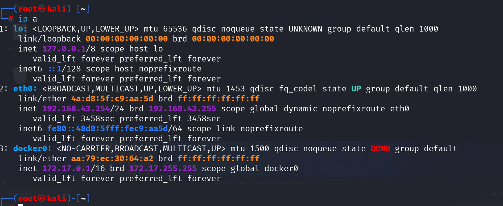
</p>

---

### Ubuntu Server

The following screenshot shows the IP configuration of the hardened Ubuntu Server.

<p align="center">
  
</p>

---

### Metasploitable 2

The following screenshot shows the IP configuration of the Metasploitable 2 vulnerable machine.

<p align="center">
  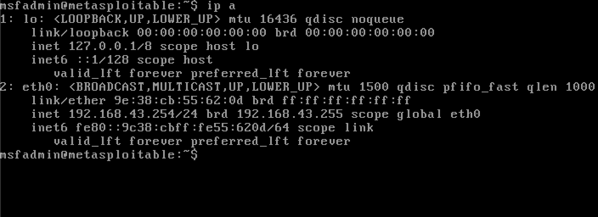
</p>

---

# 6. Security Hardening Overview

Prior to conducting the assessment, the Ubuntu server was secured using industry-recognized hardening practices.

Implemented controls included:

* System package updates
* SSH server configuration
* Root login restriction
* UFW Firewall configuration
* Fail2Ban deployment
* Auditd logging
* Lynis security audit
* User privilege management
* Password policy implementation
* Removal of unnecessary services

**Figures**

* UFW Status
* Fail2Ban Status
* Auditd Status
* Lynis Summary

---

# 7. Assessment Methodology

The assessment followed a structured vulnerability management lifecycle:

1. Network Discovery
2. Port Enumeration
3. Service Identification
4. Operating System Detection
5. Vulnerability Enumeration
6. Scanner Configuration
7. Feed Synchronization
8. Target Creation
9. Scan Preparation
10. Report Generation (Planned)

---

# 8. Network Enumeration Using Nmap

## Host Discovery

**Command**

```bash
nmap -sn 192.168.1.0/24
```

Purpose:
Identify all live hosts within the subnet.

<p align="center">
  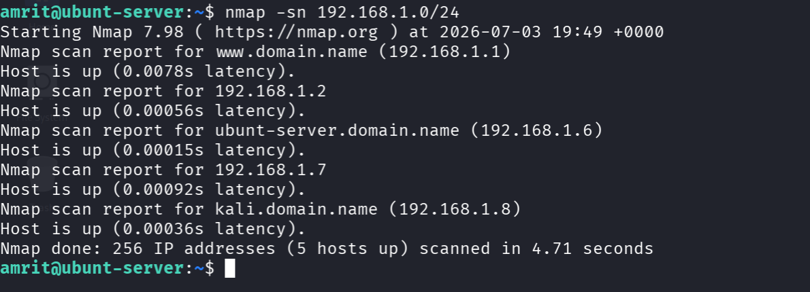
</p>

---

## Port Scan

```bash
nmap 192.168.1.6
```

Purpose:
Enumerate accessible TCP ports.

<p align="center">
  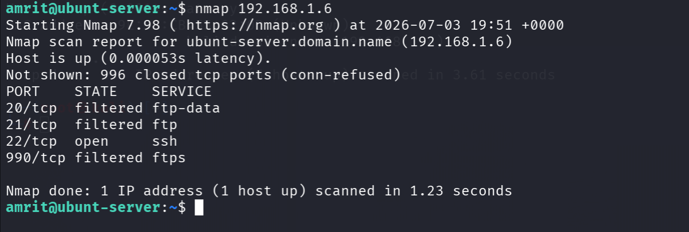
</p>

---

## Version Detection

```bash
nmap -sV 192.168.1.6
```

Purpose:
Determine service versions running on the target host.

<p align="center">
  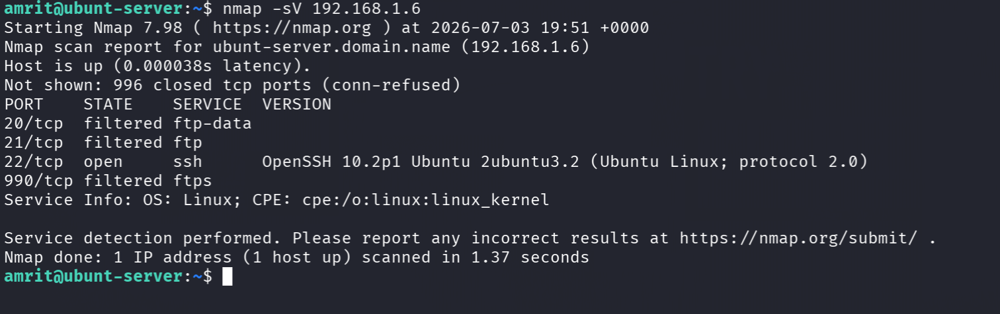
</p>

---

## Operating System Detection

```bash
sudo nmap -O 192.168.1.6
```

Purpose:
Identify the target operating system through TCP/IP fingerprinting.

<p align="center">
  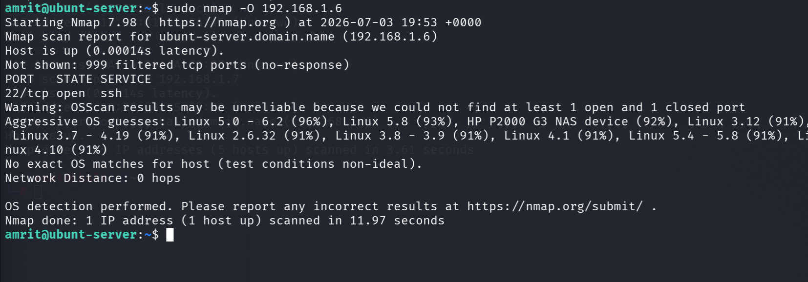
</p>

---

## Aggressive Scan

```bash
sudo nmap -A 192.168.1.6
```

Purpose:

* Version Detection
* OS Detection
* NSE Script Execution
* Traceroute

<p align="center">
  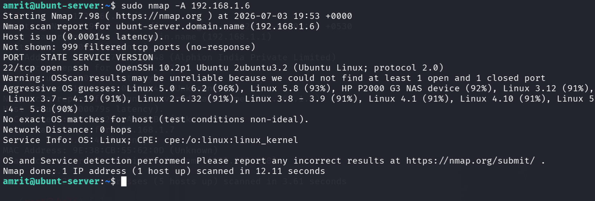
</p>

---

## Vulnerability Detection

```bash
sudo nmap --script vuln 192.168.1.6
```

Purpose:
Identify common vulnerabilities using Nmap NSE vulnerability scripts.

<p align="center">
  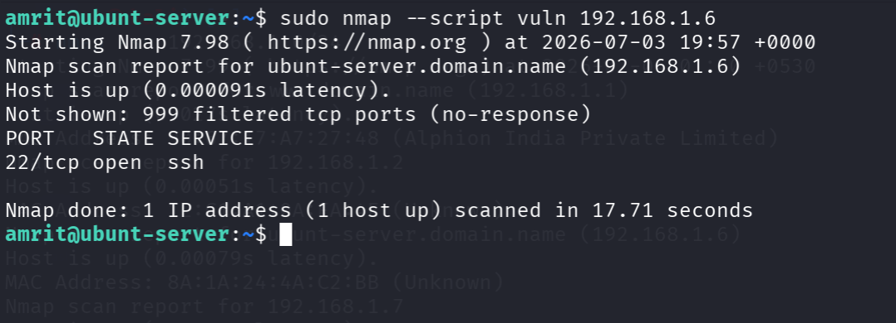
</p>

---

# 9. OpenVAS (Greenbone) Configuration

The Greenbone Vulnerability Manager (OpenVAS) platform was successfully installed and configured.

Completed tasks:

* GVM Installation
* Scanner Configuration
* PostgreSQL Configuration
* Redis Configuration
* GSAD Configuration
* Target Creation
* Scan Configuration
* Scanner Verification

**Figures**

* gvm-check-setup
* Scanner Status
* OpenVAS Dashboard

---

# 10. Feed Synchronization Status

The Greenbone Community Feed synchronization process was initiated successfully.

Synchronization Components:

* NVT Feed
* SCAP Feed
* CERT Feed
* GVMD Data Feed

At the time of project submission:

| Feed      | Status             |
| --------- | ------------------ |
| NVT       | Current            |
| SCAP      | Update in Progress |
| CERT      | Update in Progress |
| GVMD_DATA | Update in Progress |

As a result, vulnerability scanning remained temporarily unavailable while the remaining security feeds continued synchronizing.

<p align="center">
  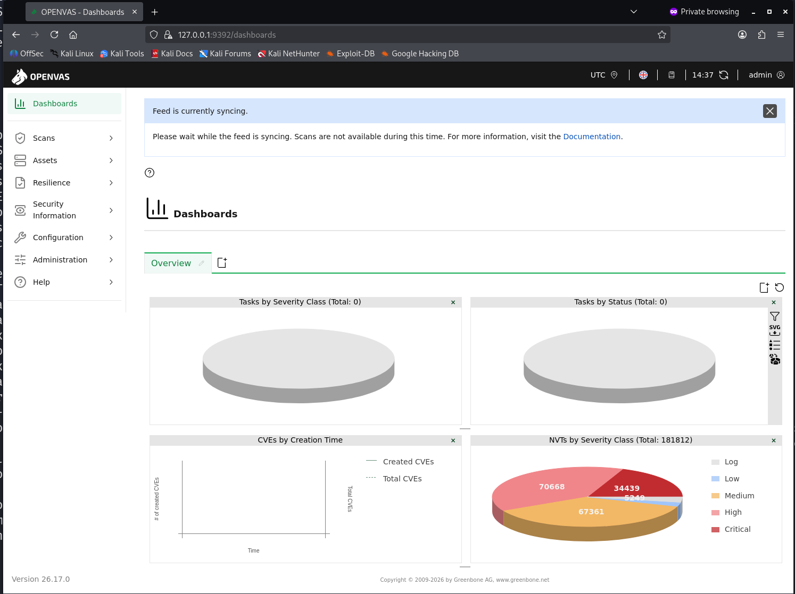
</p>

---

# 11. Target & Scan Configuration

The Ubuntu Server was successfully configured as a scanning target.

| Configuration | Value           |
| ------------- | --------------- |
| Target        | Ubuntu Server   |
| Host          | 192.168.1.6     |
| Scanner       | OpenVAS Default |
| Scan Profile  | Full and Fast   |

### Target Configuration

<p align="center">
  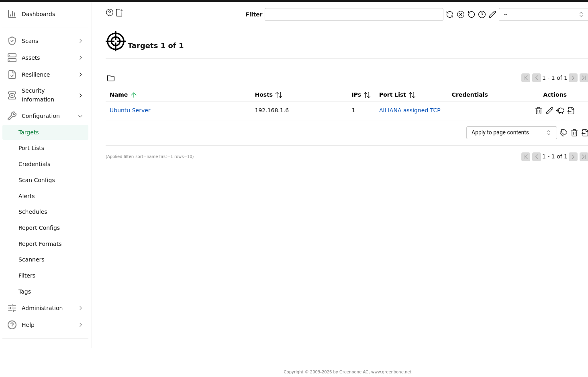
</p>

### Scan Task Configuration

<p align="center">
  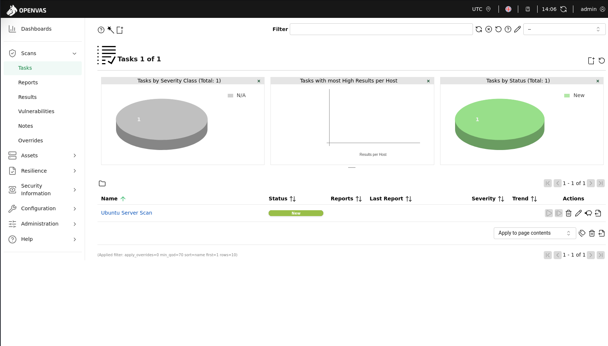
</p>

---

# 12. Observations

The following milestones were successfully completed:

* Ubuntu Server hardening
* Secure SSH configuration
* Firewall deployment
* Intrusion prevention
* Security auditing
* Host discovery
* Port enumeration
* Operating system detection
* Vulnerability scanner installation
* Scanner verification
* Feed synchronization
* Target creation
* Scan configuration

The only pending activity was execution of the vulnerability scan, which required completion of the remaining Greenbone feed synchronization.

---

# 13. Security Recommendations

Future improvements include:

* Complete Greenbone feed synchronization
* Execute scheduled vulnerability scans
* Apply vulnerability-specific remediation
* Enable automatic feed updates
* Configure email alerts
* Schedule periodic security assessments
* Integrate compliance reporting

---

# 14. Challenges Encountered

During implementation, the following challenges were encountered:

* Limited storage during virtual machine deployment
* Reinstallation of Kali Linux following storage constraints
* Extended Greenbone feed synchronization duration
* Scanner synchronization delays preventing vulnerability scan execution before the project deadline

These issues were investigated through service validation, log analysis, and multiple synchronization attempts.

---

# 15. Conclusion

The project successfully demonstrated the deployment and hardening of an Ubuntu Linux server within a virtualized penetration testing environment. Enterprise-grade security mechanisms—including firewall protection, secure SSH configuration, intrusion prevention, auditing, and vulnerability management—were successfully configured.

Although the final OpenVAS vulnerability scan could not be completed before submission due to the remaining Greenbone feed synchronization, the scanner environment, targets, and scan configurations were fully prepared. Once synchronization completes, the configured environment is capable of generating comprehensive vulnerability reports with minimal additional configuration.

---

# 16. References

* Kali Linux Documentation
* Greenbone Community Documentation
* Ubuntu Server Documentation
* Nmap Reference Guide
* CIS Ubuntu Linux Benchmark
* OWASP Testing Guide

---

THANK YOU
